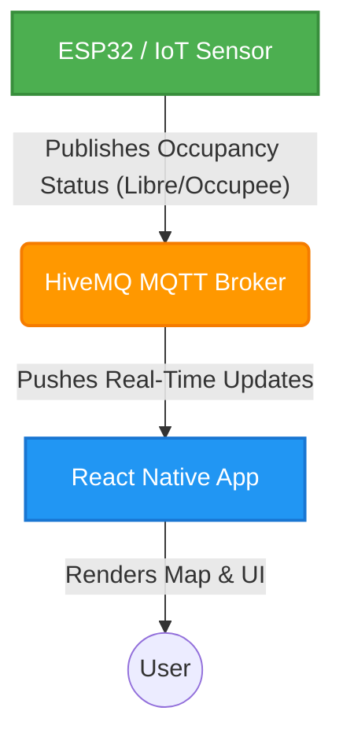

# ParkSense

ParkSense is a smart parking management application built with React Native and Expo. It integrates with IoT sensors (like ESP32) via MQTT to provide real-time updates on parking spot availability.

## 📸 Screenshots

<p align="center">
  
  
  
</p>
*(Add actual screenshots of the application here)*

## 🏗️ Architecture Diagram

Below is the high-level architecture of how ParkSense communicates with the hardware sensors in real-time.



## 🚀 Features
- **Real-Time Visualization**: Instantly see if a parking spot is free or full.
- **Interactive Map**: Navigate to available spots with a dynamic map view.
- **IoT Integration**: Direct communication with ESP32 sensors using MQTT.
- **Custom Map Markers**: High-performance, pixel-perfect map pins.
- **Favorites & Navigation**: Save frequent spots and get directions quickly.

## 🛠️ Setup Instructions

1. **Clone the repository:**
   ```bash
   git clone https://github.com/SoufianeMajd/Parksense.git
   cd Parksense
   ```
2. **Install dependencies:**
   ```bash
   npm install
   ```
3. **Start the development server:**
   ```bash
   npx expo start
   ```
4. **Run the App:** 
   Use the Expo Go app on your iOS/Android device, or run in a local simulator.

## 💻 Technologies Used
- **Frontend**: React Native, Expo, React Navigation
- **Maps**: react-native-maps
- **IoT Protocol**: MQTT (Paho client)
- **Styling**: Context-based custom theming

## 📝 TODO

- [ ] Add real application screenshots to the README.
- [ ] Connect more ESP32 sensors and map them to physical spots.
- [ ] Implement user authentication (Sign In / Sign Up).
- [ ] Add push notifications for when a spot becomes available.
- [ ] Setup CI/CD pipeline for automated testing and deployment.
- [ ] Refine the UI/UX for the spot reservation feature.
