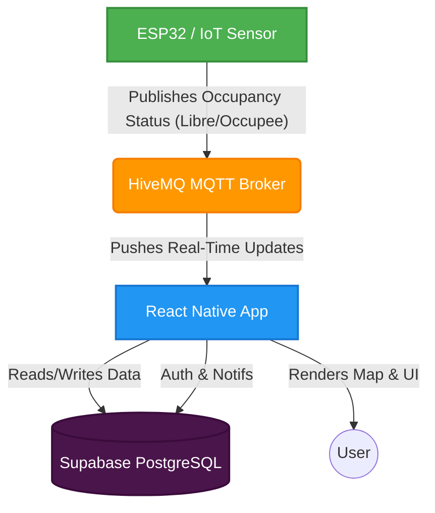
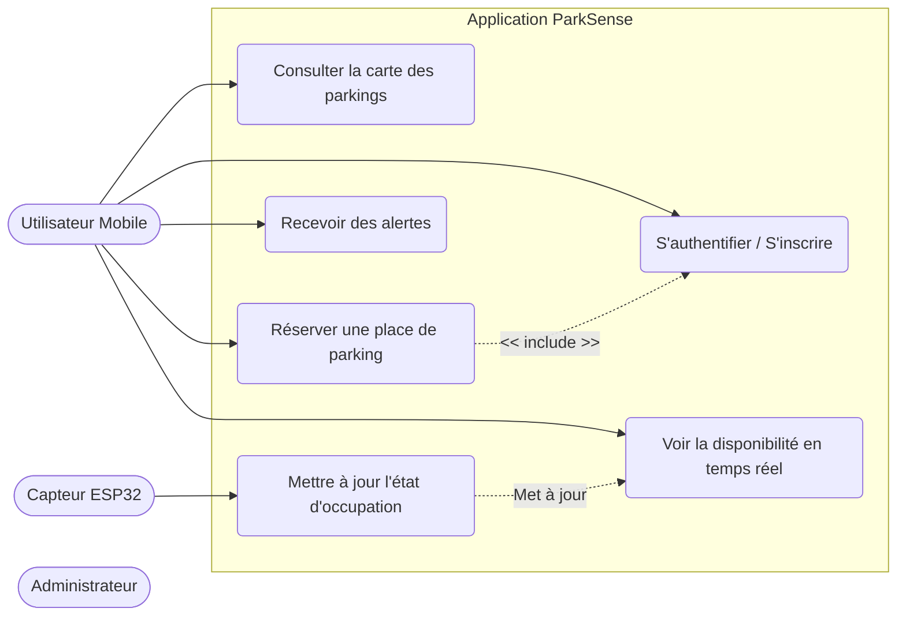
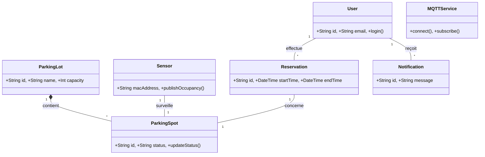
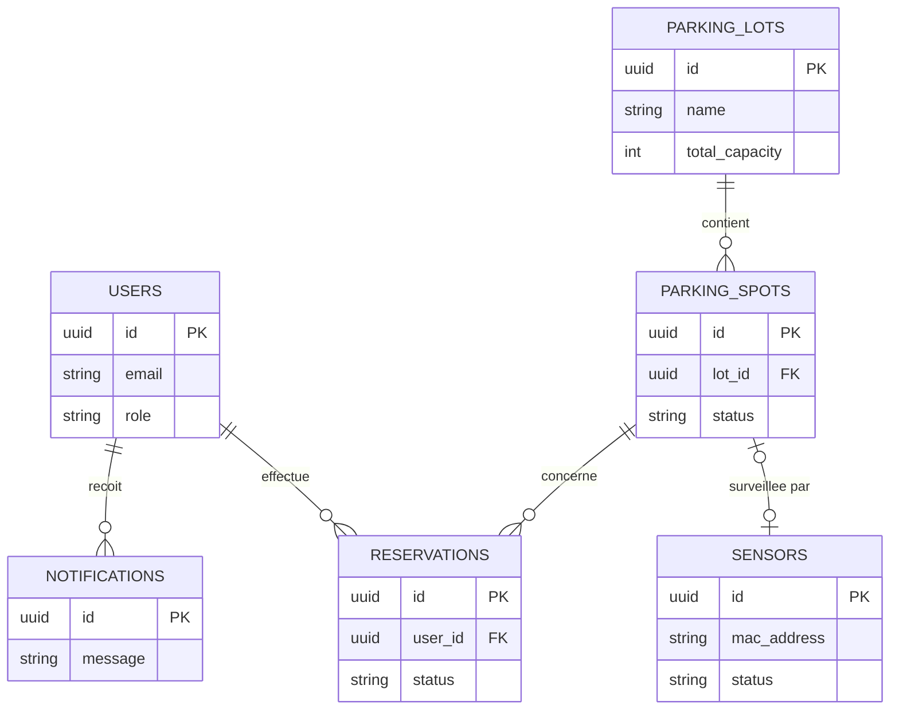
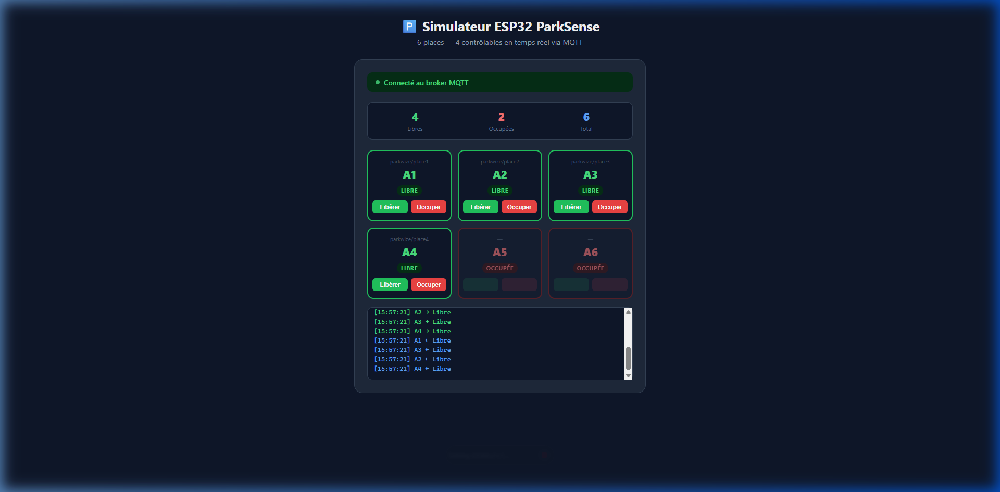

# ParkSense

ParkSense is a smart parking management application built with React Native and Expo. It integrates with IoT sensors (like ESP32) via MQTT to provide real-time updates on parking spot availability.

## 📸 Screenshots

<p align="center">
  
  
  
</p>
*(Add actual screenshots of the application here)*

## 🏗️ Architecture Diagram

Below is the high-level architecture of how ParkSense communicates with the hardware sensors in real-time.



## 📊 Diagrammes de Conception

<details>
<summary><b>1. Diagramme de Cas d'Utilisation</b></summary>


</details>

<details>
<summary><b>2. Diagramme de Classes</b></summary>


</details>

<details>
<summary><b>3. Modèle de Base de Données (ERD)</b></summary>


</details>

## 🔌 ESP32 Simulator

The repository includes a web-based ESP32 simulator to test real-time parking space updates over MQTT.
It allows you to toggle the state (`Libre` / `Occupee`) of the 4 MQTT-controlled spots (A1–A4) dynamically, while A5 and A6 remain occupied by default.

To run the simulator, simply open `simulator/index.html` in your browser.

<p align="center">
  
</p>

## 🚀 Features
- **Real-Time Visualization**: Instantly see if a parking spot is free or full.
- **Interactive Map**: Navigate to available spots with a dynamic map view.
- **IoT Integration**: Direct communication with ESP32 sensors using MQTT.
- **Authentication**: Secure user login and registration powered by Supabase.
- **Database Storage**: Robust PostgreSQL backend for users, lots, and reservations.
- **Push Notifications**: Live alerts sent directly to the device.
- **Custom Map Markers**: High-performance, pixel-perfect map pins.

## 🛠️ Setup Instructions

1. **Clone the repository:**
   ```bash
   git clone https://github.com/SoufianeMajd/Parksense.git
   cd Parksense
   ```
2. **Install dependencies:**
   ```bash
   npm install
   ```
3. **Start the development server:**
   ```bash
   npx expo start
   ```
4. **Run the App:** 
   Use the Expo Go app on your iOS/Android device, or run in a local simulator.

## 🗄️ Database Setup (Supabase)

To properly initialize your Supabase backend, you must run the provided SQL scripts in your Supabase SQL Editor in the following order:

1. **`supabase_schema.sql`**: Creates the necessary tables (`parking_lots`, `parking_spots`, `sensors`, `profiles`, `reservations`, `notifications`) and sets up Row Level Security (RLS) policies.
2. **`supabase_seed.sql`**: Populates the database with initial dummy data (parking lots, spots, etc.).
3. **Admin Account Setup**: 
   - Sign up normally in the mobile app with the email `admin@parksense.com` and a secure password.
   - In the Supabase SQL Editor, run the following query to promote this account to an Administrator role:
     ```sql
     INSERT INTO public.profiles (id, email, name, role)
     SELECT id, email, raw_user_meta_data->>'name', 'Admin'
     FROM auth.users
     WHERE email = 'admin@parksense.com'
     ON CONFLICT (id) DO UPDATE SET role = 'Admin';
     ```

## 💻 Technologies Used
- **Frontend**: React Native, Expo, React Navigation
- **Backend & Database**: Supabase (PostgreSQL), Auth, Row Level Security
- **Notifications**: Expo Notifications API
- **Maps**: react-native-maps
- **IoT Protocol**: MQTT (Paho client)
- **Styling**: Context-based custom theming

## 📝 TODO

### ✅ Completed
- [x] Implement user authentication (Sign In / Sign Up).
- [x] Add push notifications for when a spot becomes available.
- [x] Restrict Analytics screen to Admin users only.
- [x] Display real user info (name, email, role) in Home and Profile screens.
- [x] Secure sessions: auto-logout on app close (`persistSession: false`).
- [x] 15-minute session timeout with a live countdown warning modal.
- [x] Manual sign-out redirects correctly to the Login screen.
- [x] Auto-create user profile on signup.
- [x] Database schema (ERD) documented in README.
- [x] Connect 4 ESP32 spots (A1–A4) to physical/simulated MQTT topics.
- [x] Create web-based 6-spot ESP32 simulator with persistent retained messages.
- [x] Redesign ESP32 parking details UI to match Twin Center Parking.

### 🔲 Remaining
- [ ] Add real mobile application screenshots to the README.
- [ ] Setup CI/CD pipeline for automated testing and deployment.
- [ ] Refine the UI/UX for the spot reservation feature.
- [ ] Replace mock parking statistics in Profile screen with real data from Supabase.
